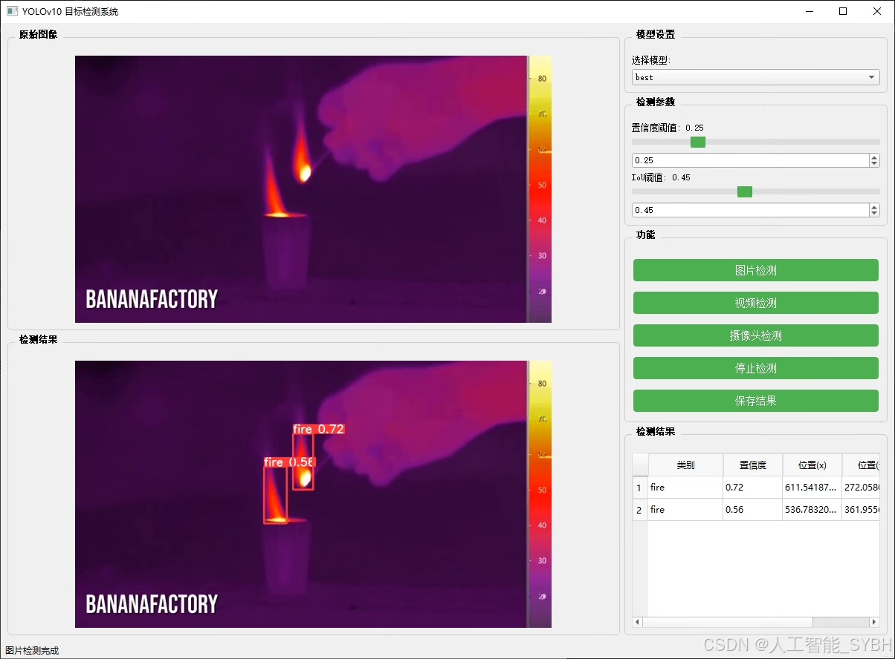
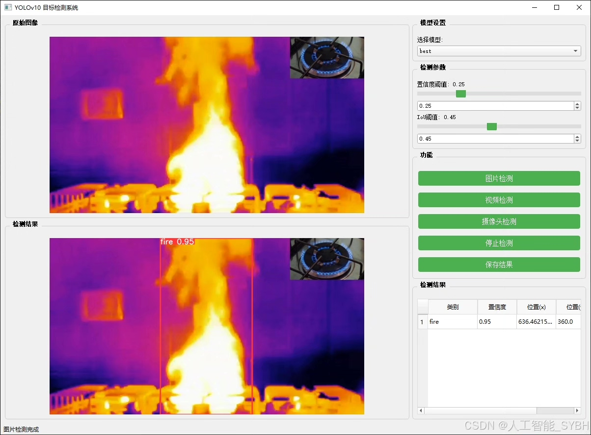
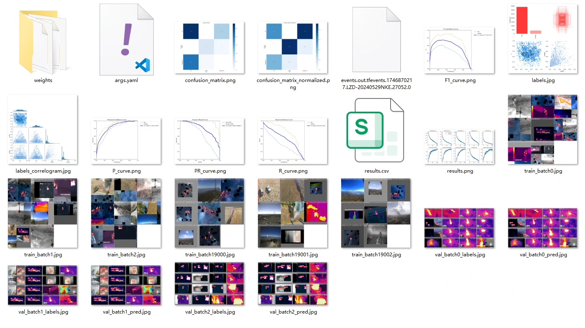
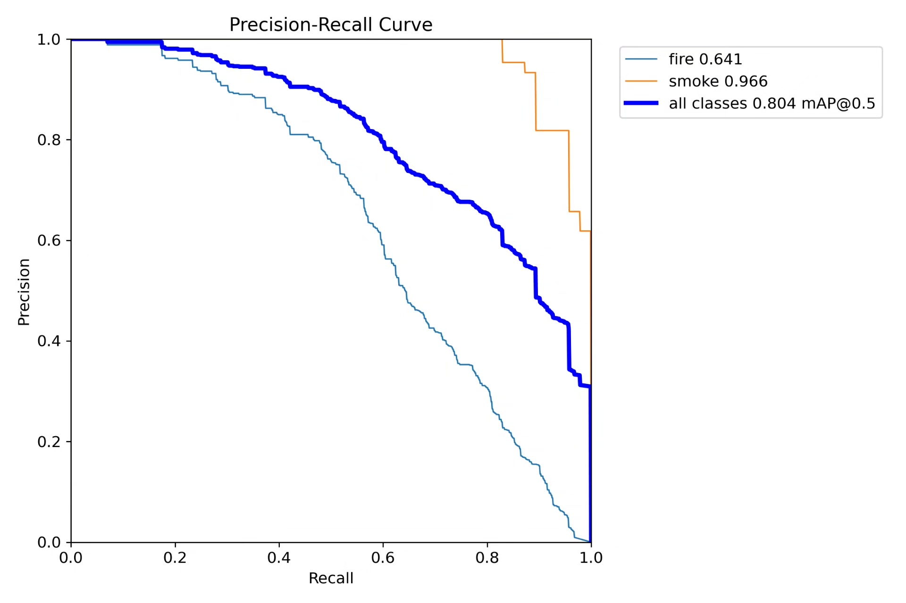
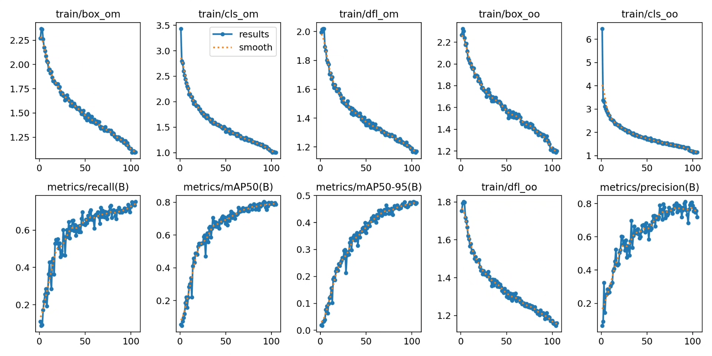
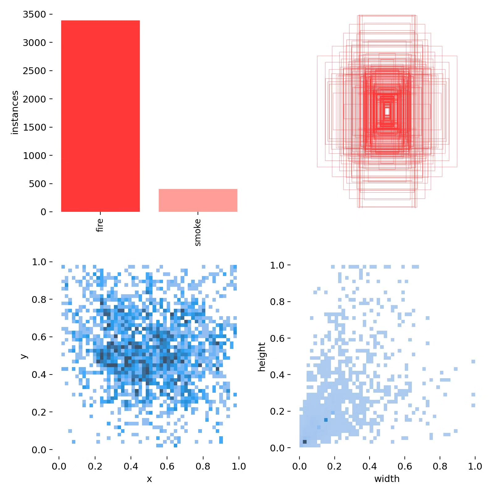
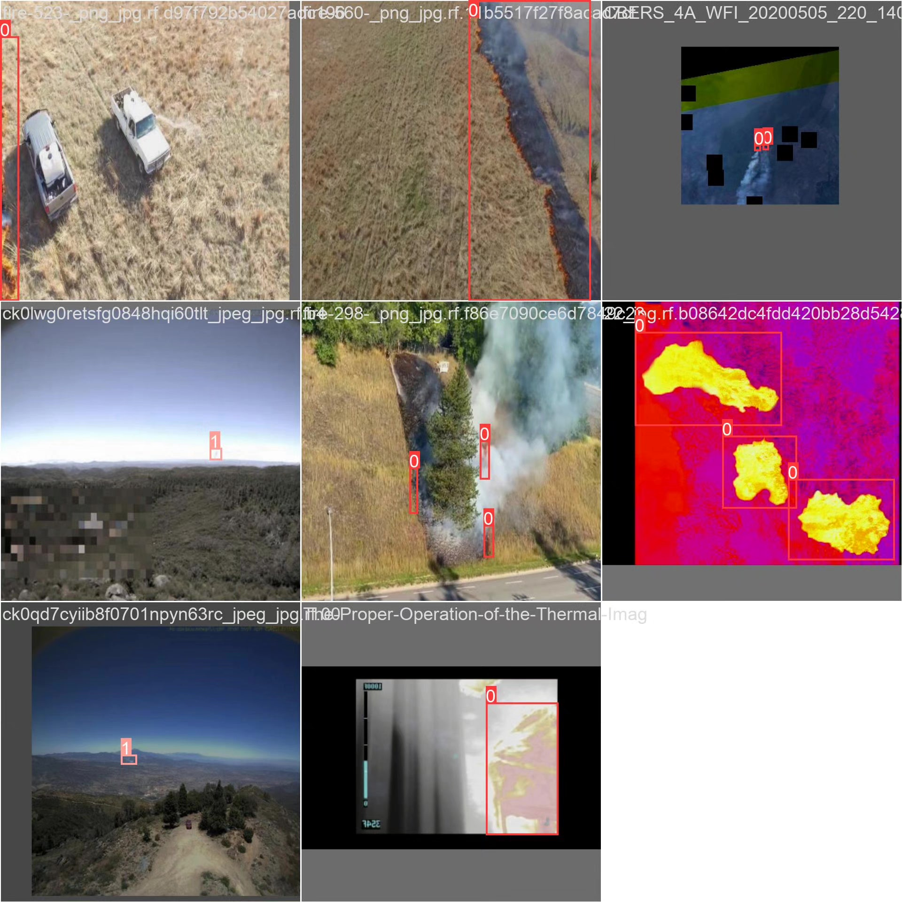
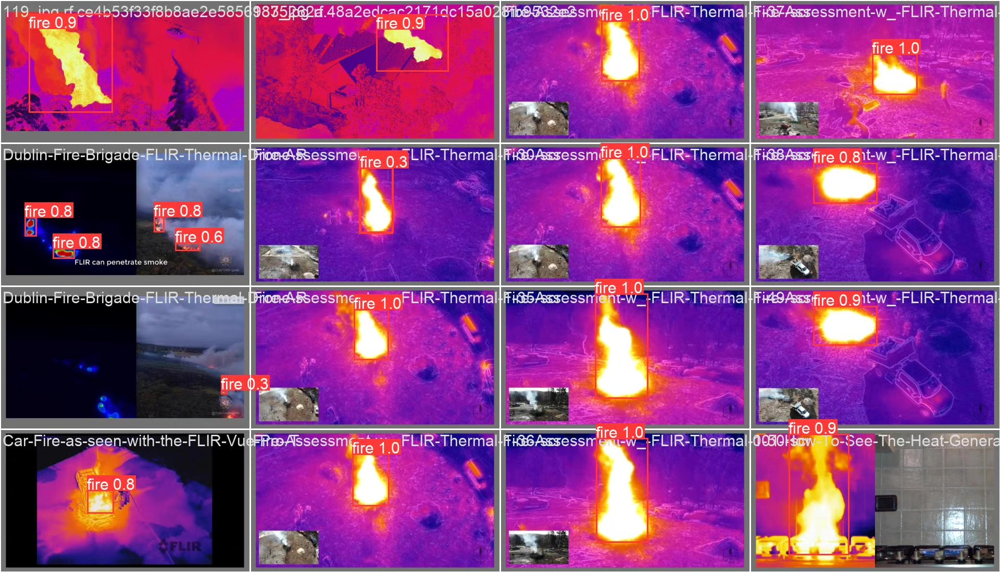

# Based on deep learning YOLOv10 for forest fire smoke and infrared detection system (YOL

## Body

Based on the advanced YOLOv10 object detection algorithm, this project has developed a high-performance forest fire smoke infrared detection system. It is specifically designed to identify and locate key targets such as fire (fire) and smoke (smoke) from infrared images. The system can achieve early fire warnings under complex natural environmental conditions through real-time analysis of infrared thermal imaging video streams, providing an intelligent solution for forest fire prevention work. The project has constructed a professional dataset containing 2000 labeled infrared images, including 1600 training sets, 200 validation sets, and 200 test sets. Experimental verification has shown that this system performs excellently in the forest fire detection task, characterized by fast detection speed, high accuracy, and low false alarm rate, effectively enhancing the efficiency and reliability of forest fire monitoring.

The company's products have obtained YOLO official commercial license certification.

We provide after-sales service.

After payment, we will provide WeChat ID for any questions.

Environment configuration: We will provide a tutorial on environment configuration, and WeChat will provide answers to questions.

Remote installation service: If you need remote configuration, an additional fee of 69 is required, with all fees refunded if the configuration fails (only refunding installation fees for older computers).

Retraining dataset: After setting up the environment, you can train on your own computer. If you need us to retrain, just pay 69 plus computing power fees (2.5 yuan/hour).

Full after-sales service

## Images

## Payment

Here is a pay link on Stripe ( https://buy.stripe.com/3cs8yP7sY87d0vu9AB ). Please contact me lonlonago@foxmail.com after funding $89, and I will send you a complete data files , thank you!

